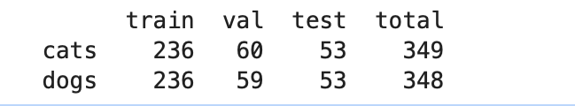
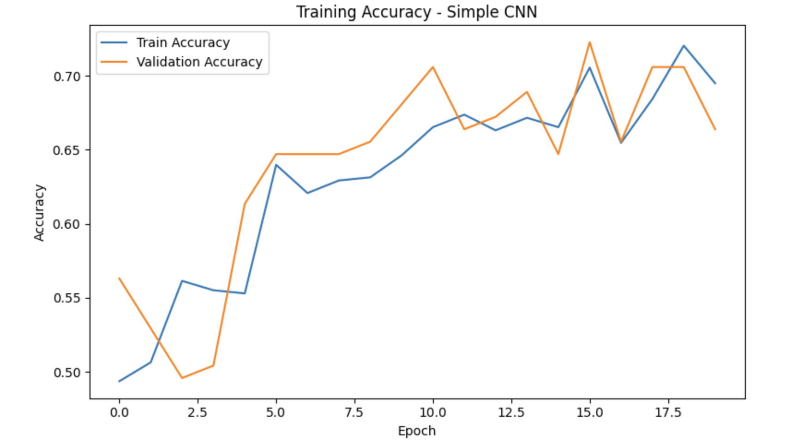
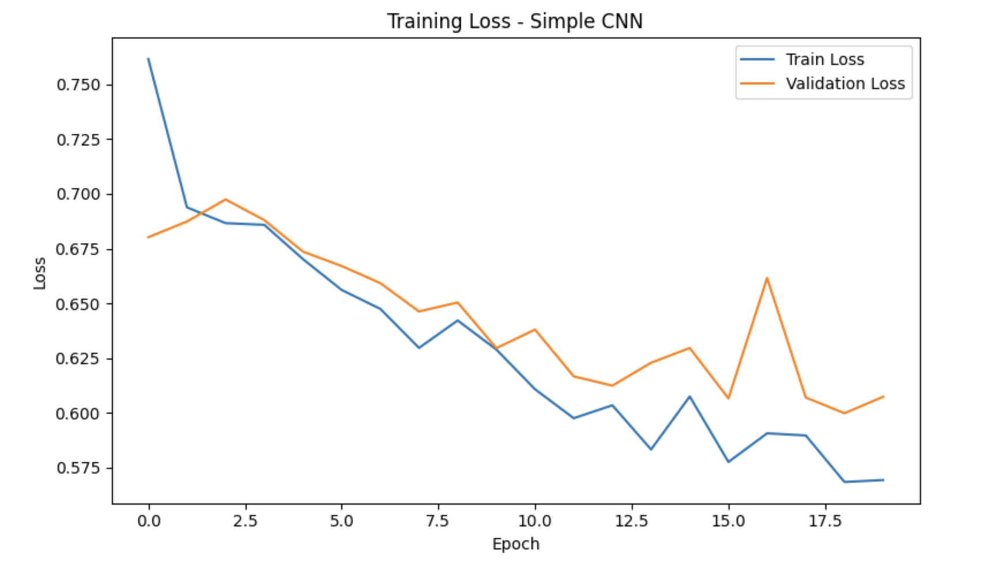
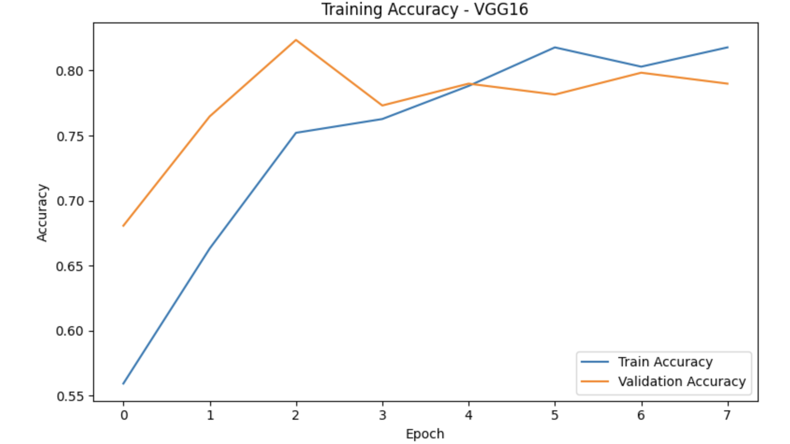
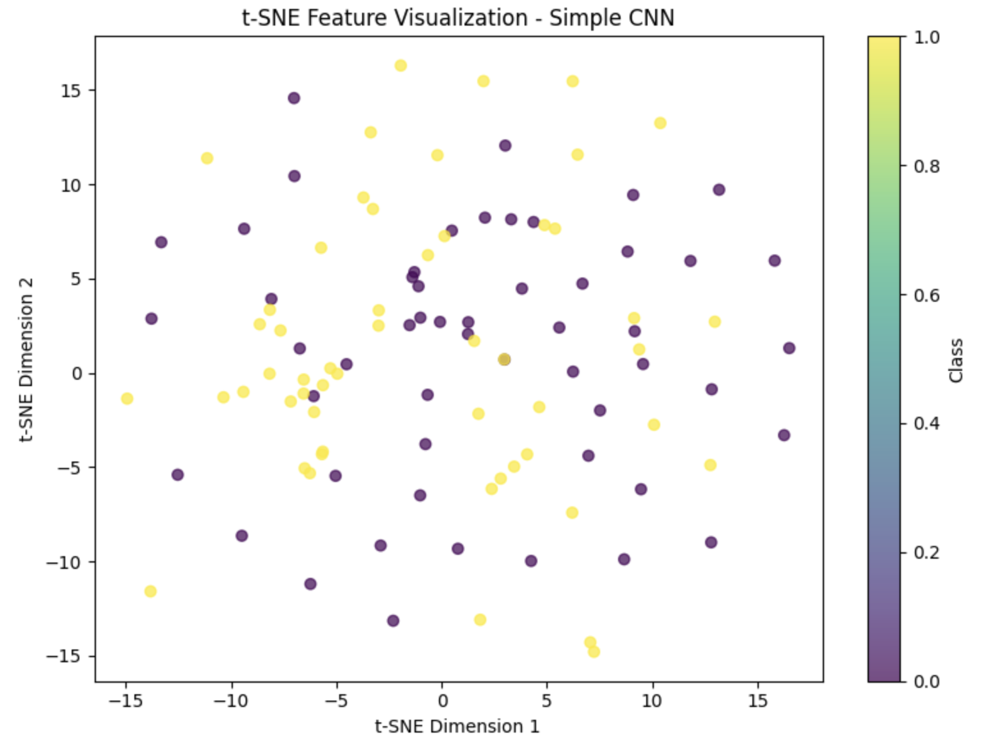

# CNN Architecture Benchmarking for Pet Image Classification

## Overview

This capstone project benchmarks multiple Convolutional Neural Network (CNN) architectures for binary image classification using a Cats vs. Dogs dataset.

The objective was to evaluate how a custom-built CNN compares against transfer learning architectures such as VGG16, ResNet50, and EfficientNetB0 in terms of classification performance, feature extraction quality, and model generalization.

This project demonstrates practical applications of deep learning, transfer learning, computer vision, model evaluation, and feature visualization techniques commonly used in industry.

---

## Project Objectives

- Build a custom CNN baseline model
- Apply transfer learning using pretrained architectures
- Compare model performance across multiple CNN architectures
- Evaluate classification accuracy and loss metrics
- Analyze feature representations using t-SNE visualization
- Identify the best-performing model for pet image classification

---

## Dataset

The dataset consists of labeled images of cats and dogs.

### Dataset Validation Results

| Category | Images |
|-----------|---------|
| Cats | 349 |
| Dogs | 348 |
| Total | 697 |

### Dataset Split

| Class | Train | Validation | Test | Total |
|---------|---------|---------|---------|---------|
| Cats | 236 | 60 | 53 | 349 |
| Dogs | 236 | 59 | 53 | 348 |

---

## Data Preparation

Prior to training:

- Invalid images were identified and removed
- Images were resized for CNN compatibility
- Dataset integrity was verified
- Training, validation, and test datasets were created

### Data Augmentation

The following augmentation techniques were applied:

- Random Rotation
- Horizontal Flips
- Zoom Transformations
- Width Shifts
- Height Shifts
- Brightness Adjustments

These transformations improve model robustness and reduce overfitting.

---

## Models Evaluated

### 1. Custom CNN

A CNN architecture built from scratch consisting of:

- Conv2D Layers
- MaxPooling Layers
- Dense Layers
- Dropout Regularization
- Softmax Output Layer

This model serves as the baseline benchmark.

---

### 2. VGG16 Transfer Learning

A pretrained VGG16 architecture trained on ImageNet and fine-tuned for binary classification.

Benefits:

- Faster convergence
- Strong feature extraction
- Improved validation performance

---

### 3. ResNet50 Transfer Learning

A deep residual network using skip connections to overcome vanishing gradient issues.

Benefits:

- Deeper architecture
- Strong representation learning
- Advanced feature extraction

---

### 4. EfficientNetB0 Transfer Learning

An optimized CNN architecture balancing:

- Network Depth
- Width
- Image Resolution

Benefits:

- Improved efficiency
- High accuracy with lower computational requirements

---

## Evaluation Metrics

Models were evaluated using:

- Training Accuracy
- Validation Accuracy
- Training Loss
- Validation Loss
- Confusion Matrix
- Classification Performance
- Feature Sparsity
- Activation Statistics
- t-SNE Feature Visualization

---

## Results Summary

### Custom CNN

The custom CNN successfully learned visual patterns distinguishing cats from dogs.

Key observations:

- Stable convergence during training
- Consistent reduction in loss
- Good baseline performance
- Demonstrated effective feature learning

---

### Transfer Learning Models

Transfer learning architectures outperformed the baseline CNN.

Benefits observed:

- Faster convergence
- Higher validation accuracy
- Better feature extraction
- Improved generalization

---

### Feature Visualization Analysis

t-SNE visualizations were generated to examine learned feature spaces.

Findings:

- Transfer learning models produced more structured feature representations.
- ResNet50 generated stronger feature clustering.
- Learned embeddings showed improved class separation compared with the baseline CNN.

---

## Visualizations

### Dataset Validation


### Data Augmentation Examples



### Simple CNN Training Results



### CNN Loss and Confusion Matrix



### Dataset Split Summary


### VGG16 Training Results



### CNN Feature Visualization



### ResNet50 Feature Visualization


---

## Technologies Used

- Python
- TensorFlow
- Keras
- NumPy
- Pandas
- Matplotlib
- Seaborn
- Scikit-Learn
- Pillow
- Jupyter Notebook

---

## Repository Structure

```text
CNN-Architecture-Benchmarking-for-Pet-Image-Classification/

│
├── notebooks/
│   └── CNN_Capstone.ipynb
│
├── visuals/
│   ├── 01_dataset_validation.png
│   ├── 02_data_augmentation_examples.png
│   ├── 03_simple_cnn_training_results.png
│   ├── 04_simple_cnn_loss_and_confusion_matrix.png
│   ├── 05_dataset_split_summary.png
│   ├── 06_vgg16_training_results.png
│   ├── 07_tsne_feature_visualization.png
│   └── 08_resnet50_tsne_feature_visualization.png
│
├── requirements.txt
├── README.md
└── LICENSE
```

---

## Key Skills Demonstrated

- Deep Learning
- Computer Vision
- Transfer Learning
- TensorFlow
- Keras
- CNN Architecture Design
- Model Benchmarking
- Data Augmentation
- Feature Engineering
- Classification Analysis
- Dimensionality Reduction
- t-SNE Visualization
- Machine Learning Evaluation

---

## Author

**Darious Brown**

PhD Candidate – Artificial Intelligence & Machine Learning

GitHub: https://github.com/Dare215

Portfolio: https://dare215.github.io/DariousBrown-Portfolio/

LinkedIn: https://www.linkedin.com/in/dariousbrown

---
