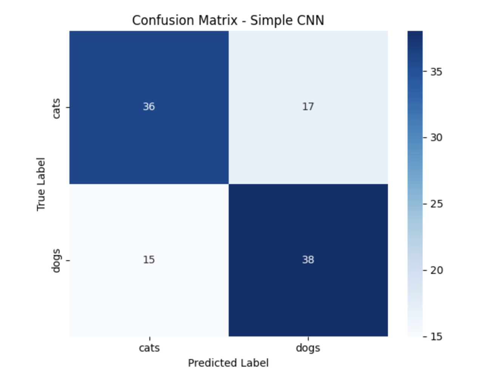

# CNN Architecture Benchmarking for Pet Image Classification

## Overview

This capstone project benchmarks multiple Convolutional Neural Network (CNN) architectures for binary image classification using a Cats vs. Dogs image dataset.

The study evaluates and compares a custom-built CNN against industry-standard transfer learning architectures, including VGG16, ResNet50, and EfficientNetB0. The objective is to analyze classification performance, feature extraction quality, model convergence behavior, and learned feature representations.

This project demonstrates practical applications of deep learning, computer vision, transfer learning, model benchmarking, and feature visualization techniques commonly used in real-world machine learning systems.

---

## Project Objectives

* Build and train a custom CNN architecture from scratch
* Apply transfer learning using pretrained CNN models
* Compare multiple CNN architectures using consistent evaluation metrics
* Analyze model convergence and training behavior
* Visualize learned feature spaces using t-SNE
* Benchmark architecture performance for production-oriented decision making

---

## Dataset

The dataset consists of labeled images of cats and dogs.

### Dataset Validation Results

| Category | Images |
| -------- | ------ |
| Cats     | 349    |
| Dogs     | 348    |
| Total    | 697    |

### Dataset Split

| Class | Train | Validation | Test | Total |
| ----- | ----- | ---------- | ---- | ----- |
| Cats  | 236   | 60         | 53   | 349   |
| Dogs  | 236   | 59         | 53   | 348   |

---

## Data Preparation

Prior to model training:

* Invalid image files were identified and removed
* Dataset integrity was verified
* Images were standardized and resized
* Train, validation, and test datasets were created

### Data Augmentation

To improve model generalization and reduce overfitting, the following augmentations were applied:

* Rotation
* Horizontal Flipping
* Width Shifting
* Height Shifting
* Zoom Transformations
* Brightness Variations

---

## CNN Architectures Evaluated

### 1. Custom CNN

A baseline convolutional neural network built entirely from scratch.

Architecture includes:

* Conv2D Layers
* MaxPooling Layers
* Dense Layers
* Dropout Regularization
* Softmax Classification Layer

Purpose:

* Establish baseline performance
* Compare against transfer learning approaches

---

### 2. VGG16 Transfer Learning

Pretrained on ImageNet.

Advantages:

* Strong feature extraction capabilities
* Faster convergence
* Improved validation performance

---

### 3. ResNet50 Transfer Learning

Residual neural network architecture utilizing skip connections.

Advantages:

* Improved gradient flow
* Strong representation learning
* Excellent feature extraction

---

### 4. EfficientNetB0 Transfer Learning

EfficientNet balances:

* Network Depth
* Width
* Resolution

Advantages:

* Computational efficiency
* High classification performance
* Optimized parameter utilization

---

## Evaluation Metrics

Models were evaluated using:

* Training Accuracy
* Validation Accuracy
* Training Loss
* Validation Loss
* Confusion Matrix
* Weighted F1 Score
* Parameter Counts
* Feature Sparsity
* Activation Statistics
* t-SNE Feature Visualization

---

## Results Summary

### Custom CNN

The custom CNN successfully learned visual features capable of distinguishing cats from dogs.

Key observations:

* Stable convergence
* Consistent reduction in training loss
* Effective baseline benchmark
* Successful feature learning

---

### Transfer Learning Models

Transfer learning architectures demonstrated superior performance relative to the baseline CNN.

Benefits observed:

* Faster convergence
* Improved validation performance
* Enhanced feature extraction
* Better generalization

---

### Feature Visualization Analysis

Feature embeddings extracted from trained models were visualized using t-SNE.

Key findings:

* Transfer learning models generated more structured feature representations.
* ResNet50 produced stronger clustering behavior.
* Feature separability improved compared to the baseline CNN.
* Learned embeddings demonstrated meaningful class discrimination.

---

## Visualizations

### Dataset Validation

Verifies successful image validation and dataset integrity.


---

### Data Augmentation Examples

Examples of augmented images used during training.


---

### Simple CNN Training Results

Training and validation accuracy progression for the baseline CNN architecture.


---

### Simple CNN Loss and Confusion Matrix

Training loss convergence and classification performance evaluation.


---

### Best Model Confusion Matrix

Visualization of classification accuracy using predicted versus actual labels.



---

### VGG16 Transfer Learning Results

Training performance of the VGG16 transfer learning architecture.


---

### t-SNE Feature Visualization

Visualization of learned feature embeddings from the CNN architecture.


---

### ResNet50 Feature Visualization

Visualization of high-dimensional feature representations extracted from ResNet50.


---

## Technologies Used

* Python
* TensorFlow
* Keras
* NumPy
* Pandas
* Matplotlib
* Seaborn
* Scikit-Learn
* Pillow
* Jupyter Notebook

---

## Repository Structure

```text
CNN-Architecture-Benchmarking-for-Pet-Image-Classification/

│
├── notebooks/
│   └── CNN_Capstone.ipynb
│
├── visuals/
│   ├── 01_dataset_validation.png
│   ├── 02_data_augmentation_examples.png
│   ├── 03_simple_cnn_training_results.png
│   ├── 04_simple_cnn_loss_and_confusion_matrix.png
│   ├── 04_confusion_matrix_best_model.png
│   ├── 06_vgg16_training_results.png
│   ├── 07_tsne_feature_visualization.png
│   └── 08_resnet50_tsne_feature_visualization.png
│
├── requirements.txt
├── README.md
└── LICENSE
```

---

## Key Skills Demonstrated

* Deep Learning
* Computer Vision
* Convolutional Neural Networks (CNNs)
* Transfer Learning
* TensorFlow
* Keras
* Model Benchmarking
* Feature Engineering
* Data Augmentation
* Feature Extraction
* t-SNE Visualization
* Classification Analysis
* Machine Learning Evaluation
* Model Performance Comparison

---

## Business Applications

The techniques demonstrated in this project can be applied across numerous industries:

* Medical Image Analysis
* Manufacturing Quality Inspection
* Autonomous Systems
* Security and Surveillance
* Retail Product Recognition
* Agricultural Image Analysis
* Wildlife Monitoring
* Defect Detection Systems

---

## Author

**Darious Brown**

PhD Candidate – Artificial Intelligence & Machine Learning

GitHub: https://github.com/Dare215

Portfolio: https://dare215.github.io/DariousBrown-Portfolio/

LinkedIn: https://www.linkedin.com/in/dariousbrown

---

*This project demonstrates the implementation, evaluation, and benchmarking of modern convolutional neural network architectures for image classification, highlighting both custom model development and transfer learning methodologies used in contemporary machine learning workflows.*
